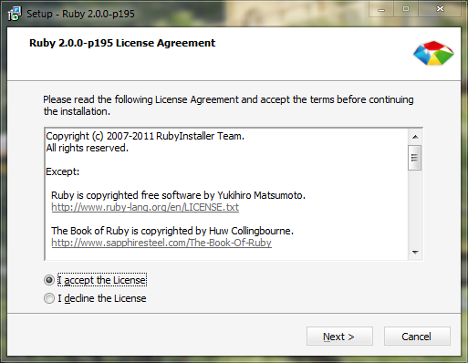
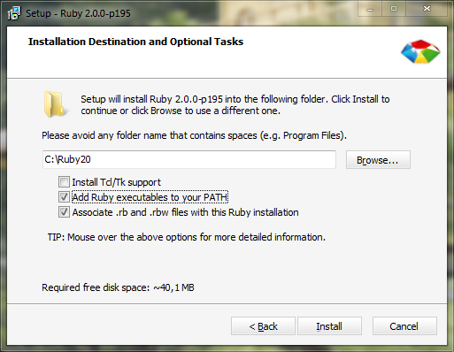

# Présentation et Introduction

Bonjour à tous !

Dans ce premier chapitre, nous allons aborder petit à petit certaines notions de base en programmation. Nous commencerons par une brève présentation du concept de la programmation, puis par celle de Ruby. Nous finirons par installer le nécessaire sur notre machine pour la suite du cours.

Vous verrez que Ruby est un langage populaire et puissant et, à travers ce chapitre, nous allons essayer de vous présenter les différents points qui le caractérisent en parlant de ses avantages et de ses inconvénients.

Bonne lecture.

## La programmation, qu'est-ce que c'est ?

Avant de se lancer tête baissée dans l'apprentissage de Ruby, répondons à une question qui peut paraître simple mais qui est pourtant essentielle :

> **Question** : La programmation, qu'est-ce que c'est ?

La programmation désigne tout simplement le fait de réaliser des programmes informatiques. Pour parvenir à réaliser ces programmes, on utilise ce que l'on appelle un _langage de programmation_.

Pour expliquer l'intérêt et le fonctionnement d'un langage, parlons un peu de votre ordinateur : aussi bizarre que cela puisse paraître, vous ne pouvez communiquer avec votre ordinateur qu'avec un seul langage, le _langage machine_ (représenté par le langage binaire ; vous en avez peut-être déjà entendu parler). Le langage binaire est un langage qui n'est constitué que de 0 et de 1. Assez compliqué de réaliser des programmes avec des 0 et des 1, pas vrai ? C'est pour cette raison que les langages de programmation existent ; ils permettent de réaliser plus simplement les programmes car ils sont plus simples et plus compréhensibles. Ils utilisent souvent des _mots clefs_ semblables à ceux d'une langue parlée (l'anglais bien souvent).

Ce qu'il faut savoir c'est qu'[il existe énormément de langages][liste langages] et qu'il n’existe pas un langage unique qui est meilleur que les autres. Il faut savoir utiliser un langage pour répondre à une certaine problématique, à certains besoins vis-à-vis d'un projet. Il est vrai qu'aujourd’hui les langages sont très polyvalents et vous pouvez utiliser la plupart du temps votre langage favori quand bon vous chante !

### Différents langages

Pour poursuivre ce cours, il est préférable d'en connaître un peu plus sur les langages de programmation. Bien évidemment, ce que l'on va voir reste dérisoire par rapport à tout ce que l'on peut apprendre sur la programmation de manière générale.

Vous verrez par la suite que les langages peuvent être classés selon différents critères. Par exemple, vous pouvez ranger d'un côté les langages compilés et de l'autre les langages interprétés. La différence réside dans l’exécution du programme. Lorsque l'on utilise un langage compilé, il faut écrire le code puis compiler le fichier (c'est-à-dire _traduire_ le code du fichier en langage machine) pour ensuite l’exécuter. Avec un langage interprété, il suffit d’exécuter le fichier une fois que vous avez écrit le code pour voir le résultat. Le compromis est que les programmes compilés sont plus rapides lors de l’exécution que les programmes interprétés. Parmi les langages compilés connus on peut citer le langage C ou le langage C++ et parmi les langages interprétés, on peut citer Ruby, Python, PHP ou encore Perl.

On peut également ranger les langages selon leur(s) paradigme(s). Un paradigme fait référence à la manière avec laquelle un programme est conçu. Les paradigmes les plus connus sont le paradigme impératif et le paradigme fonctionnel. Il est bon de noter qu'il arrive généralement qu'un langage permette de faire appel à différents paradigmes. C'est le cas de Ruby. Le fait qu'un langage supporte plusieurs paradigmes le rend plus puissant et plus simple à utiliser si on a fait de la programmation auparavant.

### Différents type de programmes

Pour conclure la première partie de ce chapitre, finissons sur les différents types
de programmes qui existent. C'est important pour la suite du cours car vous
conceptualisez sans doute les programmes comme de simples fenêtres (ce qui n'est
pas un tort car ce sont les plus répandus). Pourtant, il existe des programmes ne
faisant intervenir que l'affichage de texte et font appel à une saisie de
l'utilisateur (texte ou chiffres par exemple) lorsqu'il s'agit d'intéraction. Les
programmes que vous connaissez le mieux sont appelés programmes graphiques. On
utilise aussi fréquemment le terme de *GUI* (_Graphical User Interface_) ou
d'interface graphique.

Les programmes qui ne contiennent que du texte, quant à eux, sont appelés programmes en console. Vous vous doutez sûrement que les programmes en console sont plus simples à réaliser que les programmes graphiques. De ce fait, nous commencerons à créer des programmes en mode console. Ce n'est pas aussi excitant que de concevoir une interface graphique, mais il faut pourtant passer par là pour commencer. Par la suite vous pourrez bien sûr utiliser des outils qui vous permettront de concevoir des applications de ce genre Voici un exemple, à gauche, d'application en console et à droite d'une application graphique ; la suite bureautique LibreOffice.

La console peut être un peu rebutante mais ça sera réellement mieux pour débuter dans notre apprentissage de Ruby. C'est un outil puissant qui peu parfois paraître compliqué et imposant mais nous allons en apprendre les bases ; donc pas de panique. Dîtes vous aussi que vous devez passer par là pour pouvoir développer ensuite des applications graphiques ; ça peut être motivant !

## Présentation de Ruby

### Histoire du langage

C'est en 1993 que Yukihiro Matsumoto (surnommé « Matz ») entreprend l'écriture du langage Ruby. Il souhaitait un langage à la fois simple et amusant à utiliser et totalement orienté objet. Il n'était pas complètement satisfait de son expérience avec d'autres langages. Il reprendra cependant certaines notions et idées présentes dans ces derniers. On retrouve par exemple de grandes similitudes entre Ruby et Python ou Perl par exemple, que ce soit au niveau des concepts ou de la syntaxe. Une fois que le langage fût un peu plus mûre, la première version « stable » du langage sortit en 1995.

Avec le temps Ruby n'a cessé d'évoluer et est aujourd'hui un langage sérieux et puissant que de grandes entreprises et de grands projets utilisent. Aujourd'hui, la version actuelle de Ruby est la version 2.0.0 (qui est celle sur laquelle va se baser ce cours). Sachez que Ruby est un langage _open source_ (c'est-à-dire que vous pouvez consulter ses sources (les fichiers qui le composent) et y contribuer si vous le souhaitez). De ce fait, de nombreuses personnes améliorent le langage et le rendent plus stable et plus sécurisé.

### Ce que l'on peut faire avec Ruby

Nous verrons tout au long de ce cours que Ruby est un langage extrêmement polyvalent. Alors, vous vous demandez peut-être, qu'est-ce-que l'on peut faire avec Ruby ? La réponse est assez simple, basiquement vous pouvez faire ce que vous souhaitez. Ruby n'est pas forcément la solution pour tous vos projets mais voici une liste de domaines dans lesquels il peut être utilisé :

* **Le web** : vous pouvez utiliser Ruby pour créer des sites internet avec des
outils comme [Ruby on Rails] ou bien encore [Sinatra]. Cependant, contairement
à certains langages tel que PHP, Ruby est fréquemment utilisé dans d'autres
domaines que le web.
* **Les applications mobiles** : des outils sont à votre disposition pour réaliser des applications sur les appareils mobiles (smartphones, etc.). C'est le cas de [Ruboto] pour la plateforme Android par exemple.
* **Les scripts shell** : les scripts shell sont des programmes incluant de la manipulation de fichiers, l'automatisation de certaines tâches, l’exécution de programmes, etc.
* **Les sciences** : les bibliothèques scientifiques ne sont pas aussi nombreuses et fournies que dans d'autres langages (notamment Python) mais par exemple [SciRuby] est une bibliothèque scientifique puissante (bien qu'encore en développement).
* **Les bases de données** : comme la plupart des langages, vous pouvez utiliser Ruby pour gérer des données avec des bases. Il existe souvent un driver pour travailler avec les systèmes les plus connus (comme MySQL, PostgreSQL, MongoDB, etc.).

En plus de ces domaines, on peut également noter certains avantages que possède le langage tel que :

* Une syntaxe claire et concise : un des points forts de Ruby est sa syntaxe très claire. Par exemple, citons l'absence de points-virgules ou d'accolades. Ils peuvent être utilisés dans certains cas mais le sont très rarement. Ruby utilise aussi des noms très clairs que ce soit au niveau des mots clés ou des fonctions disponibles et vous pouvez souvent trouver la solution à votre problème sans regarder la documentation.
* Les *gems* : Ruby possède un très large écosystème de bibliothèques prêtes à être installées ce qui est un gros plus pour développer et également pour distribuer votre projet.
* Un modèle orienté objet : Ruby est un langage complètement orienté objet. Nous verrons par la suite ce concept un peu plus en détails ; vous découvrirez alors toute la puissance du langage.

Parlons tout de même des différents inconvénients qu'a le langage. Ces inconvénients peuvent parfois être handicapant mais vous verrez que globalement, ce n'est pas grand chose. Citons par exemple :

* Le manque de documentation : même si cela tend à changer, la documentation de Ruby est parfois incomplète et trouble sur certains points.
* La vitesse d’exécution : Ruby est souvent considéré comme lent. Heureusement la branche 2.0 du langage a fait de sérieux progrès là-dessus et vos programmes sont réellement lents lorsqu'ils sont très conséquents. Son efficacité est maintenant comparable aux autres langages interprétés.
* Les gems (bibliothèques) : le fait que Ruby soit multi-plateformes peut engendrer un manque de compatibilité entre les différentes plateformes. Par exemple, certaines gems ne fonctionnent pas correctement sous Windows. C'est notamment le cas de certaines gems écrites en langage C (il faut pour cela faire appel à un outil appelé [DevKit]).
* La communauté : la communauté francophone est assez mince et trouver de l'aide en français n'est pas forcément évident. vous devrez souvent regarder du côté des sites anglophones.

En espérant ne pas vous avoir fait peur, ajoutons que le langage parfait n'existe pas. Ruby a certes de gros avantages mais nous ne pouvons pas passer à côté de ses inconvénients.

### Différentes implémentations

Il faut savoir qu'il existe plusieurs « implémentations » de Ruby. C'est-à-dire que l'interpréteur ruby a été écrit dans différents langages. L'implémentation de son créateur (appelé MRI pour _Matz's Ruby Interpreter_) est la plus utilisée et est écrite avec le langage C. On peut citer par exemple JRuby, qui est une implémentation en Java du langage ou Rubinius qui en est une créée en Ruby lui-même avec un cœur en C++. Dans ce cours nous avons choisi de vous présenter MRI car c'est la plus utilisée et la plus connue. Les autres implémentations essayent d'être compatibles au maximum, vous n'aurez donc en théorie pas trop de problèmes lorsque vous souhaiterez migrer. Il y a néanmoins des différences ce qui peut rendre la chose plus intéressante.

## Installation

Nous allons enfin mettre quelque peu de côté la théorie pour passer à la pratique : l'installation de Ruby. Nous en profiterons également pour parler de l'éditeur de code.

### Installation de l'interpréteur

#### Installation sous Linux

Sous Linux, vous avez sans doute Ruby d'installé sur votre machine. Le problème
c'est que assez peu de distributions proposent Ruby dans sa version 2.0.0. Si
Ruby est déjà installé, il s'agit sûrement de la version 1.9.3. Pour connaître
la version actuelle de ruby, dans un terminal, tapez :

~~~
$ ruby --version
~~~

S'il ne s'agit pas de la bonne version, il nous faut donc installer Ruby autrement
que par le biais du gestionnaire de paquets. Il existe pour cela un tas d'outils.

L'outil que nous allons utiliser s'appelle [Chruby][] (*Change ruby*). Pour
l'installer, si vous êtes sous Arch Linux, vous pouvez le faire *via* AUR :

~~~
$ yaourt -S chruby
~~~

Sinon, téléchargez Chruby avec la commande `wget` (ou `curl`) :

~~~
$ wget -O chruby-0.3.7.tar.gz https://github.com/postmodern/chruby/archive/v0.3.7.tar.gz
$ tar -xzvf chruby-0.3.7.tar.gz
$ cd chruby-0.3.7/
$ sudo make install
~~~

Maintenant, ouvrez votre fichier `~/.bashrc` ou `~/.zshrc` et ajoutez :

~~~bash
source /usr/local/share/chruby/chruby.sh
~~~

Il vous faudra redémarrer votre terminal ou exécuter `source $SHELL` pour que
les changements soient effectifs.

Il nous faut maintenant installer ruby-install afin d'installer Ruby :

~~~
$ wget -O ruby-install-0.3.1.tar.gz https://github.com/postmodern/ruby-install/archive/v0.3.1.tar.gz
$ tar -xzvf ruby-install-0.3.1.tar.gz
$ cd ruby-install-0.3.1/
$ sudo make install
~~~

Il nous suffit maintenant d'installer la version de Ruby que nous souhaitons :

~~~
$ ruby-install ruby 2.0.0-p247
~~~

Le gros plus c'est que ruby-install est capable d’interagir avec votre gestionnaire
de paquets dans le cas où certaines dépendances nécessaires seraient manquantes.
Pour finir, il faut indiquer à Chruby que nous voulons utiliser la version que
nous venons d'installer :

~~~
$ chruby 2.0.0
~~~

Si jamais vous voulez revenir à la version par défaut livrée avec votre système,
il vous suffit d'exécuter :

~~~
$ chruby system
~~~

Vous pouvez également ajouter à votre fichier `~/.bashrc` ou `~/.zshrc` un appel
à `chruby 2.0.0` pour que cette version soit utilisée par défaut dans votre Shell.

#### Installation sous OS X

Sous Mac OS, la démarche est semblable à celle expliquée pour les utilisateurs
de Linux. Il vous faut tout d'abord installer [Homebrew]. Il suffit ensuite de
lancer un terminal et d'exécuter :

~~~
$ brew install chruby
$ brew install ruby-install
~~~

> **Information** : Si vous ne souhaitez pas faire appel à Homebrew, vous pouvez
vous référer aux instructions fournies pour les utilisateurs de Linux.

Pour finir installer la dernière version de Ruby:

~~~
$ ruby-install ruby 2.0.0-p247
~~~

Pour l'utiliser, lancer :

~~~
$ chruby 2.0.0
~~~

Si vous souhaitez que le changement se fasse automatiquement lorsque vous démarrer
votre terminal, vous pouvez ajouter cette ligne à votre fichier `~/.bashrc` (ou
bien `~/.zshrc`).

#### Installation sous Windows

Pour installer Ruby sous Windows, plusieurs moyens s'offrent à vous. Ici nous allons vous présenter l'installation _via_ RubyInstaller et nous installerons également [DevKit].

> **Information** : Il est possible d'utiliser un gestionnaire de version de Ruby sous Windows mais nous ne détaillerons pas l'utilisation d'un tel outil ici. Tournez vous du côté de [Pik].

Pour installer Ruby _via_ RubyInstaller, rendez-vous sur [le site](http://rubyinstaller.org/) et cliquez sur le bouton « Download ». Choisissez le fichier `Ruby 2.0.0-pXXX` (vous pouvez également prendre le fichier (x64) si vous avez un système 64 bits) et enregistrez le dans vos documents. Pour finir, exécutez le fichier

Un programme d'installation se lance et vous présente le texte de licence du programme (la licence est un texte officiel qui vous donne certains droits vis-à-vis d'un programme) ; acceptez donc la licence et cliquez sur « Next » :

Pour finir, le programme vous demande où vous voulez installer Ruby ; installez le dans `C:\Ruby20` par exemple. Si vous êtes sur un système 64 bits, ne l'enregistrez __surtout pas__ dans le dossier « Program Files (x86) ». Veillez également à cocher les deux dernières options en dessous de l'emplacement de l'installation. Cliquez ensuite sur « Install » :

Maintenant, Ruby est normalement bien installé sur votre ordinateur.

#### Installation sous FreeBSD

Sous FreeBSD, l'installation est très simple. Si vous souhaitez installer Ruby via
les ports, dans un terminal, tapez :

~~~
# cd /usr/ports/lang/ruby20 && make install clean
~~~

Attendez ensuite que la compilation finisse. Si vous le souhaitez, vous pouvez également installer Ruby via le gestionnaire de paquets :

~~~
# pkg_add -r ruby
~~~

Vérifiez que Ruby est bien installé en tapant `ruby -v` dans un terminal. Il vous
est également possible d'installer [Chruby] sous FreeBSD si vous souhaitez
utiliser plusieurs versions.

### Le choix de l'éditeur

Pour finir, maintenant que nous avons installé Ruby sur notre machine, nous devons finir sur un dernier point : l'éditeur de code. L'éditeur de code est un programme qui va vous permettre d'écrire notre code. C'est en fait un traitement de texte avancé pour la programmation. Certains éditeurs proposent même plus comme par exemple l’exécution du code dans l'éditeur ou la gestion poussée de certains outils. On parle alors d'IDE (*Integrated Development Environment*). Les IDE sont par conséquent plus puissants que les éditeurs.

Nous avons choisi de vous guider dans l'installation d'un éditeur plutôt populaire : Sublime Text 2. Sublime Text est normalement payant mais vous pouvez télécharger une version d'évaluation qui n'est pas limitée dans le temps ; vous aurez simplement une boîte de dialogue de temps à autre vous invitant à acheter l'éditeur.

Pour commencer, rendez-vous sur [le site de Sublime Text](http://sublimetext.com) et cliquez sur le lien « Download ». Cliquez ensuite sur le lien qui correspond au système d'exploitation que vous utilisez.

Si vous êtes sous Linux, le fichier téléchargé est une archive que vous pouvez placer où vous souhaitez sur votre disque dur contenant l’exécutable de Sublime Text. Vous pouvez, si vous le souhaitez, créer un raccourci dans votre menu, pointant vers cet exécutable.

Si vous êtes sous Mac OS X, il vous suffit d'exécuter le fichier dmg et de glisser l'icône Sublime Text dans votre dossier Applications.

Si vous êtes sous Windows, vous pouvez télécharger une version portable ou une version avec un installeur. À ce niveau, à vous de choisir ce que vous préférez. Pour ceux qui se demandent, dans les grandes lignes, la version installable se trouvera dans le menu « Démarrer » alors que la version portable sera placé où vous le souhaitez dans vos documents.

Bien sûr si vous souhaitez utiliser un éditeur auquel vous êtes habitués, nous ne vous obligeons en aucun cas l'utilisation de Sublime Text. Si cela vous intéresse, vous pouvez également vous tournez du côté de [Netbeans] et de son plugin Ruby.

## Conclusion

Ce premier chapitre nous a permis de mettre les pieds dans le plat et d'en apprendre un peu plus sur le concept de programmation. Ce n'est sans doute pas le plus passionnant que vous lirez mais il est indispensable et sachez que dès le prochain chapitre nous commencerons à pratiquer un peu plus.

[liste langages]: http://fr.wikipedia.org/wiki/Liste_des_langages_de_programmation
[Ruby on Rails]: http://rubyonrails.org/
[Sinatra]: http://sinatrarb.com/
[Ruboto]: http://ruboto.org/
[SciRuby]: http://sciruby.com/
[DevKit]: http://rubyinstaller.org/add-ons/devkit/
[Chruby]: https://github.com/postmodern/chruby*
[Homebrew]: http://brew.sh/
[Pik]: https://github.com/vertiginous/pik
[Netbeans]: http://netbeans.org/
